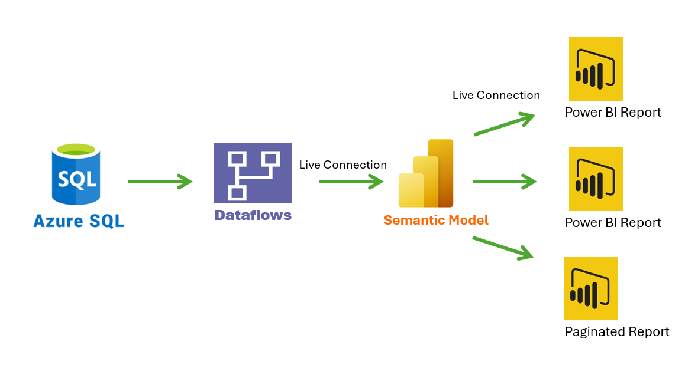

# 👤 Enterprise HR Analytics with Power BI

**Company:** Ferguson Enterprises  
**Role:** Power BI Developer / SME  
**Tools:** Power BI, Power Platform, SQL Server, DAX Studio, Tabular Editor  
**Skills:** Semantic modeling, DAX optimization, Row-Level Security (RLS), Power Query, governance standards, workflow automation

---

## 🔧 Project Overview

Ferguson Enterprises needed a scalable, secure HR analytics architecture to enable strategic workforce planning and identify emerging risks across departments. The solution required reusable components, governed data access, and the ability to support complex analysis with minimal overhead.

I led the design and implementation of a robust Power BI solution that integrated key HR data domains and provided a flexible foundation for long-term analytics initiatives. I also secured buy-in from HR leadership by articulating how the architecture would reduce time-to-insight while strengthening governance.

---

## 📌 Responsibilities

-**Redesigned the data refresh architecture** by leveraging live connections between dataflows, semantic models, and reports to improve performance and reduce duplication

- **Architected reusable semantic models** combining payroll, recruiting, candidate, associate, demographic, and position data
- **Developed a Power BI theme JSON template** to enforce branding and accelerate dashboard development
- **Implemented auditable, reusable row-level security (RLS)** to restrict data access based on user roles and reporting hierarchy
- **Utilized DAX** to generate measures from fact-less fact tables supporting advanced HR calculations
- **Collaborated cross-functionally** with HR, IT, and operational stakeholders to define goals, validate logic, and iterate on user feedback

---

## 📈 Impact

- ⚙️ **Reduced HR report development timelines** by enabling analysts to build directly on centralized semantic models  
- 🔍 **Enabled previously unavailable analytics**, such as cross-domain workforce insights and headcount trends  
- ⏱️ **Decreased refresh dependencies and duplication** by introducing modular, independently refreshed dataflows  
- 🧩 **Standardized report look and feel**, ensuring visual consistency and faster adoption  
- 🛡️ **Delivered secure analytics** through dynamic RLS, meeting audit and compliance standards
