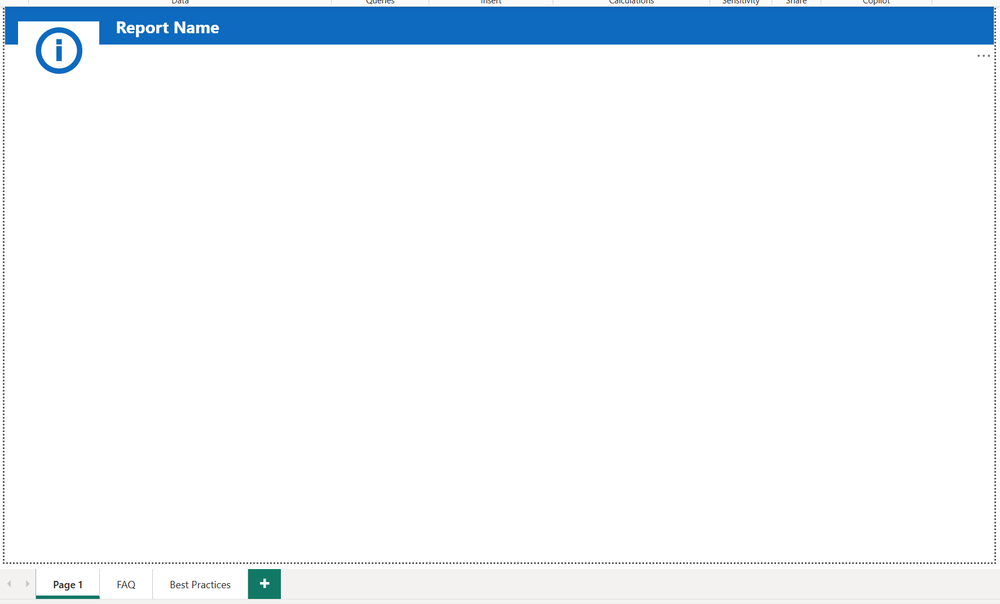

## 🎓 Power BI Training & Best Practices Enablement  

**Tools:** Power BI, DAX, Power Query, Power BI Service, Power BI Desktop  
**Skills:** Mentorship, advanced DAX, Power Query optimization, governance, best practices  

---

## 📌 Project Overview  

To support enterprise adoption of Power BI, I developed and delivered structured training sessions for developers and analysts across business units. The goal was to accelerate the team’s ability to deliver scalable, high-performing Power BI solutions and establish consistency in report development and governance.  

This is a screenshot recreation of our most basic template for all of our Power BI development.  I created this template with the goal of providing some visual consistency from report to report, but at the same time allowing developers to the freedom to implement what works in their report.  Please note the tabs.  I recommend an FAQ tab to provide any notes that might help someone consuming the report, understand the report and address any unique things about it.  The best practice tab contains some best practice guidelines like font size, visual placement, etc.  This tab would be deleted when published.

---

## 📌 Responsibilities  

- Designed and delivered **customized training sessions** for developers on Power BI best practices  
- Taught **advanced DAX** for complex measures, time intelligence, and row-level calculations  
- Demonstrated **Power Query optimization techniques** for efficient data transformations  
- Provided **mentorship and code reviews**, ensuring adherence to scalable design patterns  
- Created **documentation and reusable templates** to standardize development across teams  

---

## 📈 Impact  

- 📊 Increased team capability to deliver **enterprise-grade Power BI reports** independently  
- ⚡ Reduced report development time by enabling developers with reusable models and templates  
- 🔄 Improved consistency and performance by embedding **best practices into workflows**  
- 👥 Enhanced collaboration through shared knowledge and standardized approaches  

---

  
*Example placeholder for a diagram, screenshot of a training deck, or team workshop photo*  

