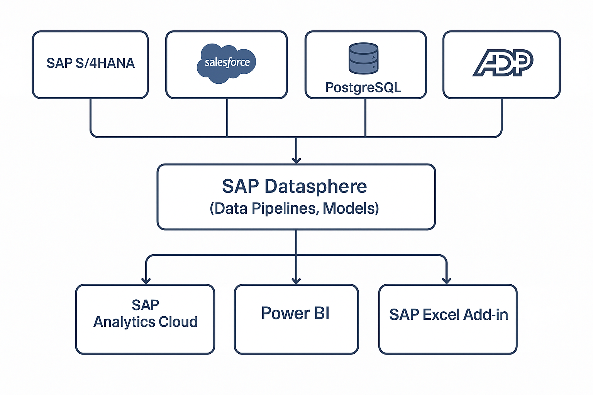

# 📊 SAP Datasphere Cloud Migration

**Company:** Tessco Enterprises  
**Role:** Project Lead / Data Engineer  
**Tools:** SAP Datasphere, SAP HANA, SAP BODS, Power BI  
**Skills:** Cloud architecture, data pipeline design, semantic model replication, SQL optimization, project management

## 🔧 Project Overview

Tessco Enterprises initiated this migration to modernize its enterprise reporting stack, improve scalability, reduce ETL overhead, and enable governed self-service analytics across business domains such as finance, operations, and sales.  Cloud replacement for SAP Hana Sidecar and SAP DataServices (BODS).

This project involved leading the migration of key enterprise data and semantic models from an on-premise SAP HANA environment to the SAP Datasphere cloud platform. The effort was not simply a lift-and-shift exercise — it was designed to modernize and enhance the enterprise BI architecture, promote reuse, and enable cloud-native scalability.

## 📌 Responsibilities

- **Develop project plan**
  - Identify prerequisites
    - Tenant Spaces
    - Capacity Units
    - System Users/Business Users
    - Premium connectors
  - Evaluate security design needs
    - Data Access Controls - Row level security
    - User permissions
  - Establish timelines & Monitoring
    - Milestones
    - Development targets
    - Executive communication
  - Determine Development Prioritization
    - Identify high use models
    - Cross-functional alignment to identify critical reports/models/datasets
  - Testing & Deployment
    - Data Testing
    - Prove End of month validation
    - Develop Power BI dashboard to enable side-by-side comparison between legacy SAP Hana Sidecar and SAP Datasphere

- **Lead replication of critical SAP HANA models into SAP Datasphere using optimized pipelines and SQL scripting**
  - Implemented developer-friendly "Quality of Life" objects (dummy tables, sequence tables, organized folders)
  - Established optimal ETL flow sequences
  - Authored documentation for master data and fact tables
  - Determined which tables to materialize in the HANA layer for SQL manipulation and external tool access
  - Built ETL flows and SQL scripts to generate facts, dimensions, and semantic models

- **Monitor and ensure performance objectives**
  - Identified and eliminated legacy job flows
  - Validated speed and performance improvements over legacy ETL

## 📈 Impact

- 📉 Decreased materialized data storage by over 80%
- ✅ Established a future-ready architecture for enterprise analytics
- 🚀 Improved data pipeline performance and model consistency across platforms
- 🤝 Enabled cross-functional teams to adopt a governed, cloud-based semantic layer
- 🧩 Streamlined the enterprise BI landscape by reducing tool sprawl and centralizing reporting logic

## 🔗 Integration With Portfolio

This project is summarized in my [main portfolio](../README.md#sap-datasphere-cloud-migration).
